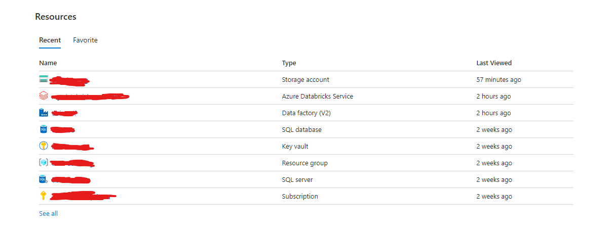

# Data Engineering Project

This project is about a data lakehouse using Azure and Databricks to store and process data from an old mmorpg game called Tibia.

Resources created on Azure.

- Resource group 
- Storage Acc with Hierarchical namespace enabled -> (Data Lake)
- Azure Data Factory
- Azure Sql Database
- Azure SQL Server
- Azure Databricks
- key vault
- Cluster on Databricks

So, how does it works

I used ChatGPT to help me to define tables related to Tibia, to do that i created a Azure sql Server to host my
Azure SQL database. Manually i refined the columns and created a model to ChatGPT generate data to populate the tables.

Used storage account to create a data lake to receive data from the database as parquet files using Azure Data Factory (ADF), which i called landing-zone,
through ADF, i created linked services to connect all resources, ADF to Datalake, ADF to Azure Sql database, ADF to Databricks, and used tables data as datasets.
On ADF i also created some flows using pipelines, my idea was to use a lookup activity to see all the tables in my database, use a query to select all the data
and copy that data to my landing zone as parquet files, after that i created Databricks notebooks to run the ingestion of raw layer.

