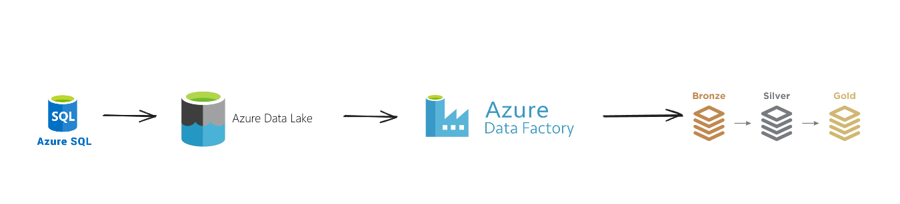
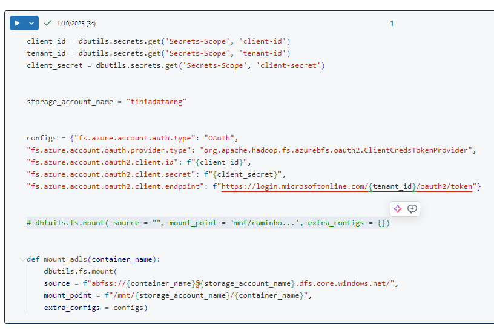
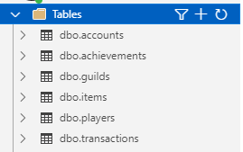
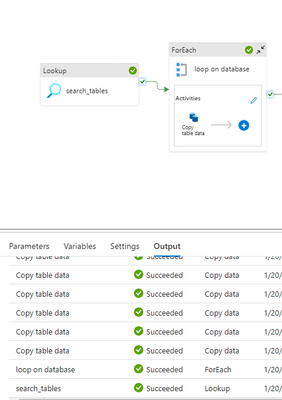
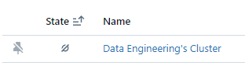
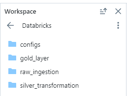
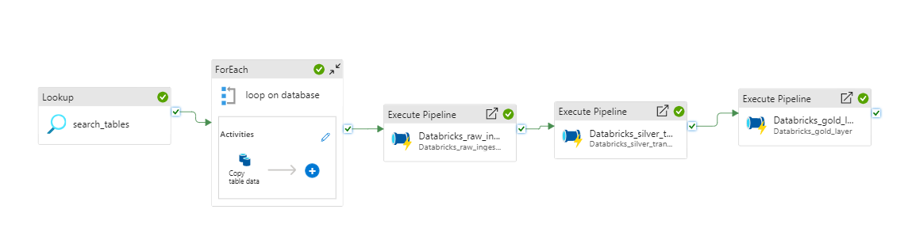

# Data Engineering Project: Building a Data Lakehouse with Azure and Databricks

This project demonstrates how to design and implement a data lakehouse using Azure and Databricks. 
It processes and stores data from the MMORPG game Tibia, showcasing a modern data engineering workflow.

Technologies Used
The project utilizes the following tools and services:

##Azure:

Azure Resource Group
Azure Storage Account (Data Lake)
Azure Data Factory
Azure SQL Server
Azure SQL Database
Azure Key Vault
Azure Databricks
Databricks:

##Databricks Clusters
Databricks Notebooks
Languages & Formats:

Python (PySpark)
SQL
Parquet

##Architecture
The project follows a modern data lakehouse architecture, as shown below:

Data Source: Structured data from the Tibia MMORPG game is stored in Azure SQL Database.
Data Ingestion: Data is ingested into an Azure Data Lake (landing zone) in Parquet format using Azure Data Factory pipelines.
Data Processing: Using Databricks, the data is processed through the bronze, silver, and gold layers in the medallion architecture.
Storage: The processed data is stored in optimized formats for further analysis or reporting.
Data Flow Overview:
Azure SQL Database → ADF Pipelines → Data Lake (bronze, silver, gold) → Databricks Processing

Data Engineering Project: Building a Data Lakehouse with Azure and Databricks
Overview
This project demonstrates how to design and implement a data lakehouse using Azure and Databricks. The goal is to store and process data from the MMORPG game Tibia, leveraging Azure services for data ingestion, transformation, and storage, following the medallion architecture (bronze, silver, and gold layers).

Technologies Used
The project utilizes the following tools and services:

Azure:

Azure Resource Group  
Azure Storage Account (Data Lake)  
Azure Data Factory  
Azure SQL Server   
Azure SQL Database  
Azure Key Vault  
Azure Databricks  
Databricks:

Databricks Clusters  
Databricks Notebooks  
Languages & Formats:

Python (PySpark)  
SQL  
Parquet  
Architecture  
The project follows a modern data lakehouse architecture, as shown below:

Data Source: Structured data from the Tibia MMORPG game is stored in Azure SQL Database.  
Data Ingestion: Data is ingested into an Azure Data Lake (landing zone) in Parquet format using Azure Data Factory pipelines.  
Data Processing: Using Databricks, the data is processed through the bronze, silver, and gold layers in the medallion architecture.  
Storage: The processed data is stored in optimized formats for further analysis or reporting.  
Data Flow Overview:  
Azure SQL Database → ADF Pipelines → Data Lake (bronze, silver, gold) → Databricks Processing  

##Steps Implemented  
1. Resource Setup on Azure  
Created an Azure Resource Group to manage resources.  
Configured an Azure Storage Account with hierarchical namespace enabled to act as the Data Lake.  
Deployed Azure SQL Server and SQL Database to host Tibia-related data.  
Set up Azure Key Vault for managing secrets securely.  
Created an Azure Data Factory for orchestrating data pipelines.  

  

  

2. Database and Table Design  
Defined database tables for storing Tibia-related data.  
Refined table schemas with ChatGPT's assistance.  
Populated the database with sample data.  

  

3. Data Ingestion with Azure Data Factory  
Created pipelines in ADF to:  
Use Lookup activity to list database tables.  
Query data from each table and copy it to the landing zone in Parquet format.  
Established Linked Services to connect ADF with Azure SQL Database, Data Lake, and Databricks.  

  

4. Data Processing with Databricks  
Mounted the Data Lake to Databricks using a cluster.  
Implemented PySpark notebooks to process data through the medallion architecture:  
Bronze Layer: Raw ingested data.  
Silver Layer: Cleansed and enriched data.  
Gold Layer: Aggregated data for analysis.  

  

  

  

5. Integration and Automation  
Linked Databricks notebooks to ADF pipelines.  
Configured ADF to trigger Databricks jobs for data processing.  

  

